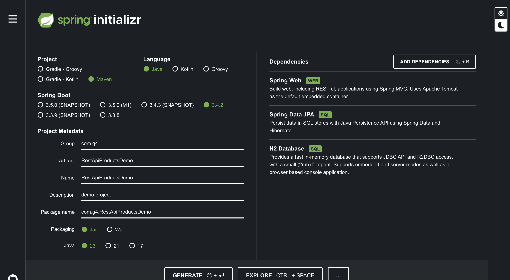

# REST API Products Demo
HI FROM TRIXI
**NOTES:**
Before committing `git pull`

**Reference Article:** <br>
https://medium.com/@pratik.941/building-rest-api-using-spring-boot-a-comprehensive-guide-3e9b6d7a8951

## Setting up
Create a new Spring Boot project using Spring Initializer. Add the following dependencies:

#### Spring Boot

https://start.spring.io/



#### Rabbit MQ (To be used by `V3` of the API)

For **MacOS**

```bash
brew install rabbitmq
```

Check if it's properly installed
```bash
brew info rabbitmq
```

Start the RabbitMQ server
```bash
brew services start rabbitmq
```

Access the RabbitMQ Management Console

<http://localhost:15672>

**Username:** guest

**Password:** guest

Stop the RabbitMQ server
```bash
brew services stop rabbitmq
```

## How to Use

1. Clone the repository
2. Open the project in IntelliJ
3. In `src/main/java` folder you may choose `com.g4.RestApiProductsDemo` package,
4. Open the `RestApiProductsDemoApplication.java` file and run the application
5. Access <http://localhost:8080> in the browser
6. You may try experimenting with the endpoints below in Postman.

## H2 Console

1. Open another tab and navigate to this url <http://localhost:8080/h2-console>
2. Enter the login credentials found in `src/main/resources/application.properties` file.
    - **JDBC URL** - `jdbc:h2:mem:testdb`
    - **User Name** - `root`
    - **Password** - `password`
3. Once logged in you can try accessing the data.
    - **Checking data in Product Table** - `SELECT * FROM PRODUCT`
    - **Updating a product** - `UPDATE PRODUCT SET PRICE = 56000 WHERE ID = 1`
    - **Deleting a product** - `DELETE FROM PRODUCT WHERE ID = 1`
    - **Inserting a product** - `INSERT INTO PRODUCT (ID, NAME, DESCRIPTION, PRICE) VALUES (2, 'Alinenware', 'Gaming Laptop', 75000)`

4. H2 SQL
   INSERT INTO PRODUCT (id, name, description, price)
   VALUES
   (1, 'Macbook Pro', 'For soydevs', 100000.0),
   (2, 'Alienware', 'Gaming Laptop', 75000.0);


## Endpoints

### `V1` Endpoints
- Simple REST API, No Exception handling and Asynchronous processing.

#### 1. Get All Products

`GET` - http://localhost:8080/api/v1/product

Sample Response

```json
[
   {
      "id": 1,
      "name": "Macbook Pro",
      "description": "For soydevs",
      "price": 100000.0
   },
   {
      "id": 2,
      "name": "Alienware",
      "description": "Gaming Laptop",
      "price": 75000.0
   }
]
```

#### 2. Get Product by ID

`GET` - http://localhost:8080/api/v1/product/1

Sample Response
```json
{
   "id": 1,
   "name": "Macbook Pro",
   "description": "For soydevs",
   "price": 100000.0
}
```

#### 3. Create new Product

`POST` - http://localhost:8080/api/v1/product

`Body` -

```json
{
   "name": "Alienware",
   "description": "Gaming Laptop",
   "price": 75000
}
```

#### 4. Update Product

`PUT` - http://localhost:8080/api/v1/product/1

`Body` -

```json
{
  "name": "Macbook",
  "description": "It just works.",
  "price": 75000
}
```

#### 5. Delete Product by ID

`DELETE` - http://localhost:8080/api/v1/product/1


### `V2` Endpoints
- Implemented Exception handling

#### 1. [V2] Get All Products (With Exception Handling)

`GET` - http://localhost:8080/api/v2/product

Sample Response

```json
[
   {
      "id": 1,
      "name": "Macbook Pro",
      "description": "For soydevs",
      "price": 100000.0
   },
   {
      "id": 2,
      "name": "Alienware",
      "description": "Gaming Laptop",
      "price": 75000.0
   }
]
```

#### 2. [V2] Get Product by ID (With Exception Handling)

`GET` - http://localhost:8080/api/v2/product/2

**NOTE:** Assuming that Product with ID 2 does not exist.

Sample Response
```json
Product not found
```

#### 3. [V2] Create new Product (With Exception Handling)

`POST` - http://localhost:8080/api/v2/product

**NOTE:** Assuming that the request body exceeds the required parameters (3)

`Body` -

```json
{
   "name": "Alienware",
   "description": "Gaming Laptop",
   "price": 75000,
   "hehe": 1
}
```

Response
```json
Product must not have additional attributes
```

**NOTE:** Assuming that the request body does not contain at least "name", "description", and "price".

`Body` -

```json
{
   "name": "Alienware",
   "description": "Gaming Laptop",
   "hehe": 75000
}
```

```json
Product must have name, description, and price
```


#### 4. [V2] Update Product (With Exception Handling)

`PUT` - http://localhost:8080/api/v2/product/1

**NOTE:** Assuming that the product does not exist

```json
Product not found
```

**NOTE:** Assuming that the request body exceeds the required parameters (3)

`Body` -

```json
{
  "name": "Macbook",
  "description": "It just works.",
  "price": 75000, 
   "hehe": 1
}
```

Response
```json
Product must not have additional attributes
```

#### 5. [V2] Delete Product by ID

`DELETE` - http://localhost:8080/api/v2/product/1

**NOTE:** Assuming that the Product with ID `1` does not exist

```json
Product not found
```

#### 6. [V2] Authenticated Endpoints (/secured)

1. Creating an Auth user

`POST` - <localhost:8080/authenticate>

`Body` - x-www-form-urlencoded

```
username: user
password: password
```

Copy the auth token from the response

2. Get all songs

`GET` - <localhost:8080/songs>

`Authorization` - Bearer Token

NOTE: Paste the auth token copied from the previous step

Sample Response

```json
{
   "error": "OK",
   "message": [
      {
         "id": 1,
         "name": "Alienware",
         "description": "Gaming Laptop",
         "price": 75000.0
      }
   ],
   "timestamp": "2025-01-28T12:28:53.764316",
   "status": 200
}
```

### `V3` Endpoints
- Implemented Asynchronous Requests

#### 1. [V3] Synchronous Request Demo

`GET` - http://localhost:8080/api/v3/product/sync

**NOTE:** This will take 3 seconds to process.

Response
```
Processes Completed
```

#### 2. [V3] Asynchronous Request - Single Response

`GET` - http://localhost:8080/api/v3/product/asyncSingle

Response
```
Process Completed
```

#### 3. [V3] Asynchronous Request - Event Response

`GET` - http://localhost:8080/api/v3/product/asyncEvent

Response (Started)
```json
{
    "message": "Process started",
    "threadName": "http-nio-8080-exec-1",
    "threadId": 40
}
```

Wait for 3 seconds then

Response (Completed)
```json
{
    "message": "Process completed",
    "threadName": "http-nio-8080-exec-1",
    "threadId": 40
}
```