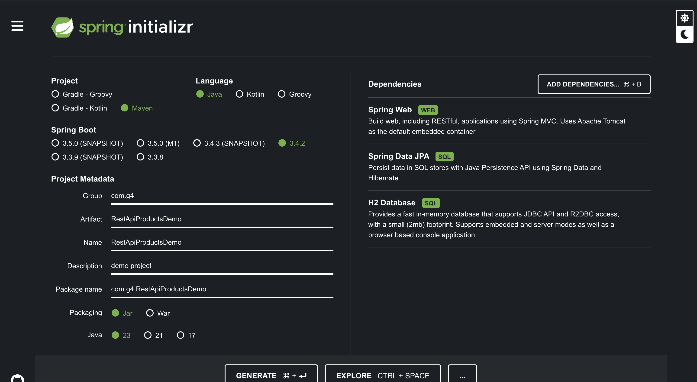

# REST API Scorecards Demo
HI FROM TRIXI
**NOTES:**
Before committing `git pull`

**Reference Article:** <br>
https://medium.com/@pratik.941/building-rest-api-using-spring-boot-a-comprehensive-guide-3e9b6d7a8951

## Setting up
Create a new Spring Boot project using Spring Initializer. Add the following dependencies:

https://start.spring.io/



## How to Use

1. Clone the repository
2. Open the project in IntelliJ
3. In `src/main/java` folder you may choose `com.g4.RestApiScorecardsDemo` package,
4. Open the `RestApiScorecardsDemoApplication.java` file and run the application
5. Access <http://localhost:8080> in the browser
6. You may try experimenting with the endpoints below in Postman.

## H2 Console

1. Open another tab and navigate to this url <http://localhost:8080/h2-console>
2. Enter the login credentials found in `src/main/resources/application.properties` file.
    - **JDBC URL** - `jdbc:h2:mem:testdb`
    - **User Name** - `root`
    - **Password** - `password`
3. Once logged in you can try accessing the data.
    - **Checking data in Product Table** - `SELECT * FROM SCORE_CARD`
    - **Updating a product** - `UPDATE SCORE_CARD SET SCORE = 75 WHERE ID = 1`
    - **Deleting a product** - `DELETE FROM SCORE_CARD WHERE ID = 1`
    - **Inserting a product** - `INSERT INTO SCORE_CARD (ID, NAME, DESCRIPTION, SCORE) VALUES (2, 'Backwards Compatibility', 'Backwards Compatibility', 75)`

## Endpoints

### `V1` Endpoints
- Simple REST API, No Exception handling and Asynchronous processing.

#### 1. Get All Scorecards

`GET` - http://localhost:8080/api/v1/scorecards

Sample Response

```json
[
   {
      "id": 1,
      "name": "Best Practices",
      "description": "Best Practices",
      "score": 99
   },
   {
      "id": 2,
      "name": "Backwards Compatibility",
      "description": "Backwards Compatibility",
      "score": 75
   }
]
```

#### 2. Get Scorecard by ID

`GET` - http://localhost:8080/api/v1/scorecards/1

Sample Response
```json
{
   "id": 1,
   "name": "Best Practices",
   "description": "Best Practices",
   "score": 99
}
```

#### 3. Create new Scorecard

`POST` - http://localhost:8080/api/v1/scorecards

`Body` -

```json
{
   "name": "Backwards Compatibility",
   "description": "Backwards Compatibility",
   "score": 75
}
```

#### 4. Delete Scorecard by ID

`DELETE` - http://localhost:8080/api/v1/scorecards/1


### `V2` Endpoints
- Implemented Exception handling

#### 1. Get All Scorecards

`GET` - http://localhost:8080/api/v2/scorecards

Sample Response

```json
[
   {
      "id": 1,
      "name": "Best Practices",
      "description": "Best Practices",
      "score": 99
   },
   {
      "id": 2,
      "name": "Backwards Compatibility",
      "description": "Backwards Compatibility",
      "score": 75
   }
]
```

#### 2. Get Scorecard by ID

`GET` - http://localhost:8080/api/v2/scorecards/1

Sample Response
```json
{
   "id": 1,
   "name": "Best Practices",
   "description": "Best Practices",
   "score": 99
}
```

#### 3. Create new Scorecard

`POST` - http://localhost:8080/api/v2/scorecards

`Body` -

```json
{
   "name": "Backwards Compatibility",
   "description": "Backwards Compatibility",
   "score": 75
}
```

#### 4. Delete Scorecard by ID

`DELETE` - http://localhost:8080/api/v1/scorecards/1